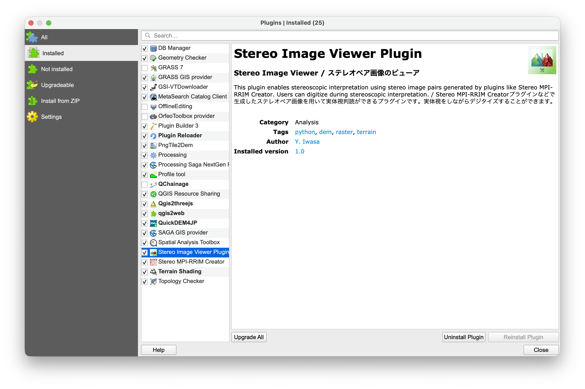
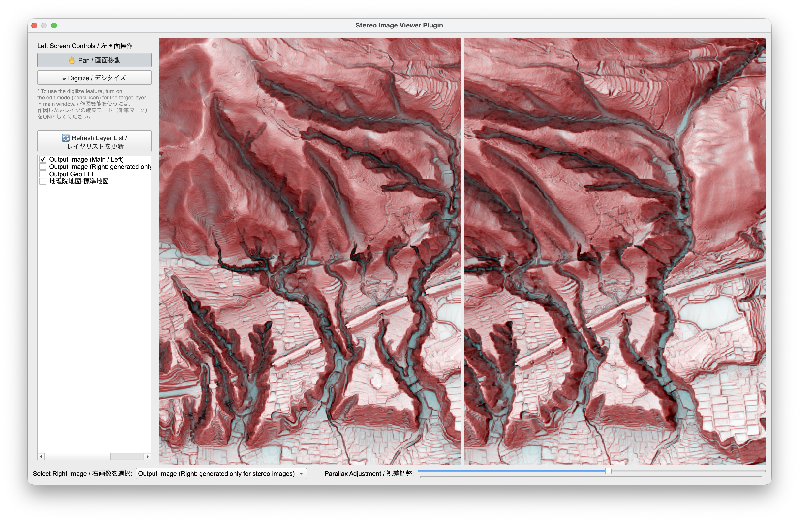

# Stereo Image Viewer Plugin for QGIS

### English | [日本語](#japanese-日本語)

# English
## Overview
**Stereo Image Viewer** is a QGIS plugin that allows you to view stereopaired images and digitize features directly within a dual-canvas environment.

## Key Features
* **Dual Map Canvas**: Displays two separate images (for the left and right eyes) with fully synchronized panning and zooming.
* **Parallax Adjustment Slider**: Intuitively adjust the X-coordinate offset (parallax) between the left and right images.
* **Custom Digitize Tool**: Draw points, lines, and polygons directly during stereoscopic interpretation.

## Installation
* **Download directly from the QGIS Plugin Repository**
  * Open QGIS, go to "Manage and Install Plugins...", search for "Stereo Image Viewer", and install it.
  * Icon will be added to top panel, or you can find "Stereo Image Viewer" in the Processing Toolbox.

* **Download from this repository**
  * Click "Code" at the top of this page and select "Download ZIP" to download the repository.
  * Open QGIS, go to "Manage and Install Plugins...", select "Install from ZIP", and choose the downloaded ZIP file.
  * Enable the plugin.
  * Icon will be added to top panel, or you can find "Stereo Image Viewer" in the Processing Toolbox.

## Usage & Parameter Tips
* **Prepare stereopaired images**: Prepare stereopaired images with coordinate using tools such as the [Stereo MPI-RRIM Creator Plugin](https://github.com/yiwasa/Stereo-MPI-RRIM-Creator).
* **Select layers**: 
  * For image for the left eye, check the box in the layer list of the plugin window.
  * For image for the right eye, select it from the `Select Right Image` dropdown menu at the bottom. 
* **Adjust Parallax**: Move the slider to align the left and right images to a position where stereoscopic viewing is comfortable for you.
* **Zoom In/Out**: Use mouse/touchpad scrolling (two-finger swipe up/down), the on-screen zoom buttons, or the shortcut keys (F2: Zoom In, F3: Zoom Out).
* **Digitize**: 
  * In the main QGIS window, select the target vector layer you want to draw on and **turn on Toggle Editing (pencil icon)**.
  * In the plugin window, select the "✏️ Digitize" button.
  * Left-click on the canvas to add vertices, and **Right-click to finish**. The standard QGIS attribute input dialog will then appear.

## Screenshots

### Plugin execution example

*Example: Running the plugin and displaying the generated DEM in QGIS.*

### Plugin image

### Viewer example

## Acknowledgments
I would like to express my deepest gratitude to Dr. Heitaro Kaneda of Chuo University for providing valuable insights and feedback.

Google's Gemini was used to assist with algorithm design, debugging, code refactoring, and drafting this README documentation for the creation and improvement of this plugin and its source code.

All final design decisions, verifications, and operational tests were strictly conducted by the author.

## License
[GNU General Public License v3.0](LICENSE)

# Japanese (日本語)

## 概要
**Stereo Image Viewer** は、ステレオペア画像をQGIS上で実体視判読しながらデジタイズすることができるQGISプラグインです。

## 主な機能
* **2画面での実体視が可能**: 1組のステレオペア画像を左右に表示することで、実体視を行うことができます。左右の画面は同期して動作します。
* **視差調整のスライダー**: スライダーを操作することで、左右の画像間の視差を直感的に調整できます。
* **デジタイズツール**: 実体視判読をしながら、ポイントやライン、ポリゴンのデジタイズを行うことができます。

## インストール方法
* QGISプラグインリポジトリから直接ダウンロード
  * QGISを起動し、「プラグインの管理とインストール」から「Stereo Image Viewer」を検索し、追加
  * 上部パネルにアイコンが追加、もしくはプロセシングツールボックスに「Stereo Image Viewer」が追加

* このリポジトリからダウンロード
  * このページ上部の「Code」から「Download ZIP」を選択し、ZIP形式でダウンロードします。
  * QGISを起動し、「プラグインの管理とインストール」から「ZIPからインストール」でダウンロードしたZIPファイルを選択
  * プラグインを有効化
  * 上部パネルにアイコンが追加、もしくはプロセシングツールボックスに「Stereo Image Viewer」が追加

## 使い方・パラメータのコツ
* **ステレオペア画像の準備**: [ステレオMPI-RRIM Creatorプラグイン](https://github.com/yiwasa/Stereo-MPI-RRIM-Creator)などを使用して座標つきのステレオペア画像を作成し、QGISにインポートしてください。
* **レイヤの選択**: 
  * 左画面に表示したいレイヤは、左側リストのチェックボックスをONにします。
  * 右画面に表示したいレイヤは、下部の`右画像を選択`のプルダウンから選択します。
* **視差の調整**: スライダーを動かし、左右の画像が立体視しやすい位置に合わせます。
* **拡大・縮小**: マウスおよびタッチパッド（二本指で上下）のスクロールや拡大・縮小ボタン、ショートカットキー（F2:拡大、F3:縮小）で行うことができます。
* **デジタイズ（作図）**: 
  * QGISのメイン画面で、作図したいベクタレイヤを選択し、**「編集モード（鉛筆アイコン）」をON**にします。
  * プラグイン画面で「✏️ Digitize / デジタイズ」ボタンを選択します。
  * キャンバスを左クリックして頂点を追加し、**右クリックで確定**します。属性入力ダイアログが表示されます。

## スクリーンショット

### 実行デモ

### プラグイン画面

### ステレオMPI-RRIMを表示させた例

## 謝辞
本プラグインの作成にあたって、中央大学の金田平太郎博士には機能の追加に関して貴重なご意見をいただきました。厚く御礼申し上げます。

本プラグインおよびソースコードの作成・改良にあたっては、GoogleのGeminiを用い、アルゴリズム設計、デバッグ、コード整理および README 文書作成の補助を受けました。

最終的な設計判断、検証、動作確認はすべて作者自身が行っています。

---
## License
[GNU General Public License v3.0](LICENSE)